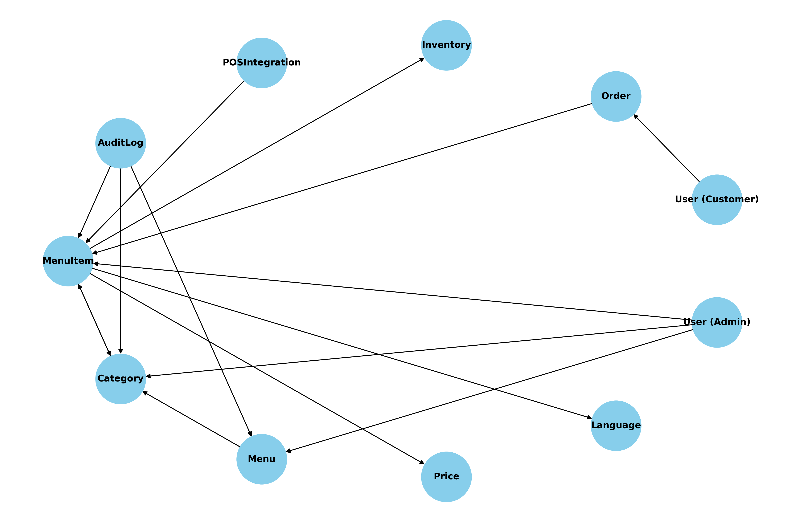

```python
import matplotlib.pyplot as plt
import networkx as nx

# Initialize the graph
G = nx.DiGraph()

# Add nodes (entities)
entities = [
    "MenuItem", "Category", "Menu", "Price", "Language", 
    "Order", "User (Admin)", "User (Customer)", "Inventory", "POSIntegration", "AuditLog"
]

# Define relationships (edges)
relationships = [
    ("MenuItem", "Category"),  # MenuItem belongs to Category
    ("Category", "MenuItem"),  # Category contains MenuItems
    ("Menu", "Category"),      # Menu contains Categories
    ("MenuItem", "Price"),     # MenuItem has a Price
    ("MenuItem", "Language"),  # MenuItem has multiple Languages
    ("User (Admin)", "Menu"),  # Admin manages Menu
    ("User (Admin)", "Category"),  # Admin manages Category
    ("User (Admin)", "MenuItem"),  # Admin manages MenuItem
    ("User (Customer)", "Order"),  # Customer places Order
    ("Order", "MenuItem"),     # Order contains MenuItems
    ("MenuItem", "Inventory"), # MenuItem linked to Inventory for availability
    ("POSIntegration", "MenuItem"),  # MenuItem integrates with POS
    ("AuditLog", "MenuItem"),   # AuditLog tracks changes to MenuItem
    ("AuditLog", "Category"),   # AuditLog tracks changes to Category
    ("AuditLog", "Menu")        # AuditLog tracks changes to Menu
]

# Add edges (relationships) to the graph
for rel in relationships:
    G.add_edge(*rel)

# Plot the graph
plt.figure(figsize=(12, 8))
pos = nx.spring_layout(G, seed=42)  # Layout for a clearer display
nx.draw(G, pos, with_labels=True, node_color='skyblue', node_size=3000, font_size=10, font_weight='bold', arrows=True)
plt.title("Menu Management Domain Model")
plt.show()

```


Here is the diagram representing the domain model for the Menu Management system. Each node represents an entity, and the arrows represent relationships between those entities. This visual gives an overview of how the components, such as `MenuItem`, `Category`, `Menu`, `Order`, and others, interact with each other within the system.

Let me know if you'd like any changes or further details!